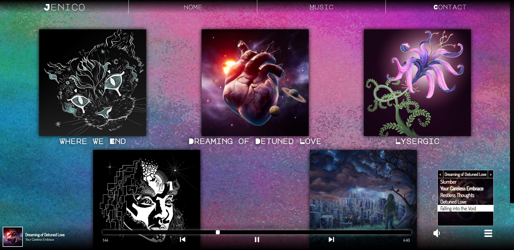

# Jenico

A website created using React and Typescript to play and display song information for the music producer Jenico.

## Table of Contents

1. [Dependencies](#dependencies)
2. [Setup](#setup)
3. [Commands](#commands)
4. [Attribution](#attribution)

## [Live Preview](https://perrybaran.github.io/jenico/)



## Dependencies

1. [TypeScript](https://www.typescriptlang.org/)
2. [React](https://reactjs.org/)
3. [React-Router-Dom](https://www.npmjs.com/package/react-router-dom)
4. [Firebase](https://firebase.google.com/)
5. [EmailJS](https://www.emailjs.com/)
6. [Jest](https://jestjs.io/)
7. [React Testing Library](https://testing-library.com/docs/react-testing-library/intro/)

### Dev Dependencies

1. [@types/node](https://www.npmjs.com/package/@types/node)
2. [gh-pages](https://www.npmjs.com/package/gh-pages)
3. [prettier](https://prettier.io/)
4. [typescript-plugin-css-module](https://www.npmjs.com/package/typescript-plugin-css-modules)

## Setup

1. Clone the repo to a local file.

```
$ git clone https://github.com/PerryBaran/jenico
```

2. Install all dependencies.

```
$ npm i
```

## Commands

### `npm start`

Runs the app in the development mode.\
Open [http://localhost:3000](http://localhost:3000) to view it in the browser.

### `npm test`

Launches the test runner in the interactive watch mode.

### `npm run build`

Builds the app for production to the `build` folder.

### `npm run prettier`

runs prettier on all files to formal code.

### `npm run predeploy`

helps to bundle the react app. This command is run automatically when running deploy.

### `npm run deploy`

Generates a production build of the app and deploys it to GitHub pages.

## Attribution

Created by **Perry Baran**.
